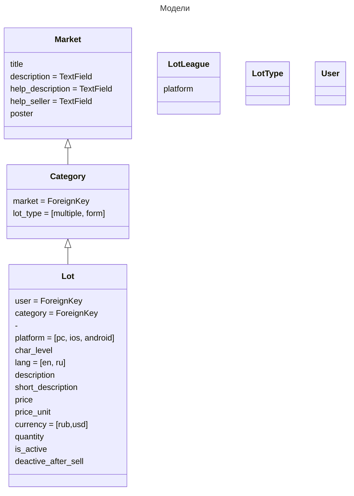

# Market

Практика создания маркета

## Цели

---
1. ~~Создание разных групп пользователей и их разделение~~
2. Создание дешборда
3. Создание маркета
    - Конвертация цены на лету
    - Таксация товара продавца
    - Интеграция с разными платежными шлюзами
        - crypto
        - stripe
        - сбер
        - yoomoney
        - qiwi
4. Создание CRM на основе маркета
5. Переход на DRF
6. Тренировка Vue
7. Тренировка github/gitlab CI

## TODO

- Разработка моделей маркета подобие FunPay, но с разделением на покупатель/продавец

## Модели

