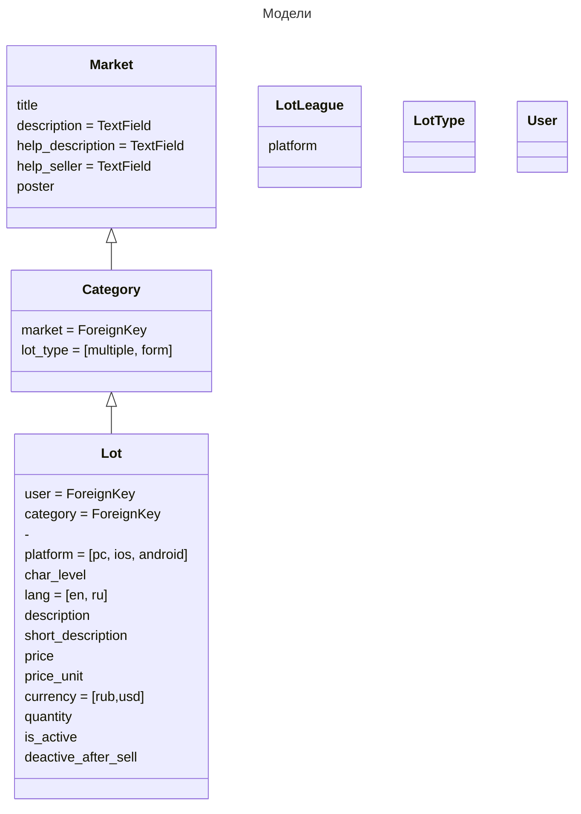

# Market

Практика создания маркета

## TODO
---

1. Формы регистрации
    - ~~2 стиля формы (1, 2 колонны)~~
    - Корректное отображение ошибок формы
    - Корректное отображение messages
    - Улучшение верстки-рефакторинг
    - Тестирование
3. Дешборд
    - Улучшение верстки-рефакторинг
    - Формы обновления профиля
    - Тестирование
4. Доработка webpack билдера или замена на Vite, gulp
5. Найти место для messages
6. Настройка страниц ошибки под общий стиль
7. Оптимизация изображений

## Цели

---
1. ~~Создание разных групп пользователей и их разделение~~
2. ~~Создание дешборда~~
    - ~~Форма обновление аватара пользователя~~
    - ~~Форма обновление аватара ajax~~
    - ~~Форма обновление информации о пользователе~~
    - Test validators
3. ~~Вход при помощи metamask~~
    - Test MetamaskLoginTests
4. ~~Статические страницы~~
    - ~~Добавление app pages + Тестирование~~
    - ~~Редактирование статики в админе~~
5. Реферальная система
6. Создание маркета
    - Конвертация цены на лету
    - Таксация товара продавца
    - Интеграция с разными платежными шлюзами
        - crypto
        - stripe
        - сбер
        - yoomoney
        - qiwi
7. Создание CRM на основе маркета
8. Переход на DRF
9. Тренировка Vue
10. Тренировка github/gitlab CI

## Модели

