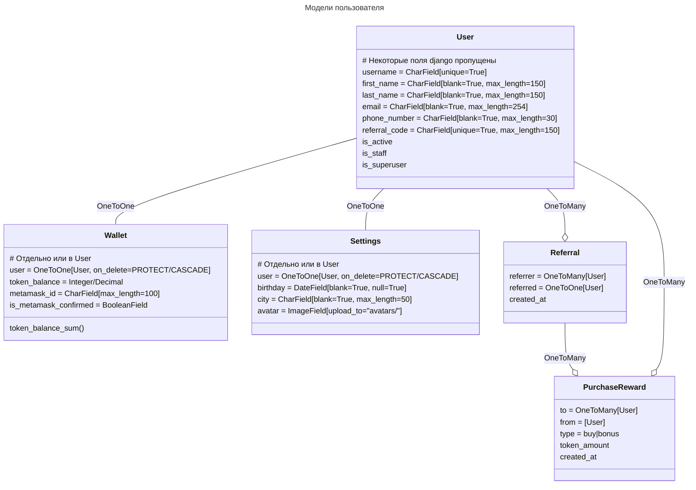
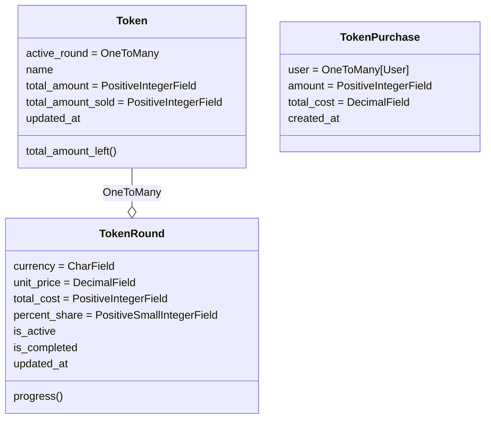

# Market

Практика создания маркета

## TODO
---

1. Реферальная система
    - При регистрации пользователя по реферальной ссылке, мы добавляем этого реферала пользователю
    - Бонусная программа

## Архитектура

---
Разделение на 4 слоя

1. dashboard
    - Выводит данные токенов и пользователя
    - Обрабатывает формы

2. referrals
    - Модели (Referral, PurchaseReward)
    - Логика
    - Views - редиректы для перехода по ссылке

3. tokens
    - Модели (Token, TokenRound, TokenPurchase)
    - Бизнес логика
    - Переодические задачи по обновлению

4. users
    - Модели (User, Settings, Wallet)
    - Реферальный код можно убрать, если он дублирует username
    - Wallet/Settings можно держать в User, в зависимости от масштаба

---

## Цели

---
1. ~~Создание разных групп пользователей и их разделение~~
2. ~~Создание дешборда~~
    - ~~Форма обновление аватара пользователя~~
    - ~~Форма обновление аватара ajax~~
    - ~~Форма обновление информации о пользователе~~
    - Test validators
3. ~~Вход при помощи metamask~~
    - Test MetamaskLoginTests
4. ~~Статические страницы~~
    - ~~Добавление app pages + Тестирование~~
    - ~~Редактирование статики в админе~~
5. Реферальная система

    1. Define the referral program structure:
        - Determine the rewards: Decide on the rewards that users can earn through the referral program. Rewards could be in the form of discounts, credits, or other benefits.

        - Number of levels: Determine the number of levels in the referral program. For example, you may want to allow users to earn rewards for referring other users and also for the referrals made by the users they referred.

        - Conditions for earning rewards: Set the conditions for earning rewards, such as the number of referrals required or the amount spent by the referred user.

    2. Create referral models:
        - Create a Referral model to store information about the referral program, such as the referral code, the user who referred, the user who was referred, and the rewards earned.

        - Create a Reward model to store information about the rewards, such as the type of reward, the amount, and the user who earned it.

    3. Create referral views:
        - Create a view to handle the referral code input by the user. The view should validate the code and associate the referral with the user.

        - Create a view to handle the referral signup process. The view should validate the referral code and create the referral record.

        - Create a view to display the referral history and the rewards earned by the user.

    4. Create referral templates:
        - Create HTML templates to display the referral program information and referral forms.

        - Include referral program information in the user account pages and other relevant pages.

    5. Integrate referral program with authentication:
        - Use Django authentication to ensure that only authenticated users can participate in the referral program.

        - Associate the referral program with user accounts to track referrals and rewards earned by each user.

    6. Track referrals:
        - Create a view to display the user's referrals and rewards earned.

        - Implement logic to track the number of referrals and the rewards earned by the user.

    7. Implement referral logic:
        - Implement logic to track the referrals, assign rewards, and update the referral history.

        - Create methods to calculate the rewards earned based on the referral program structure.

        - Associate the referral program with the user accounts to track the referrals and rewards earned by each user.

    8. Test the referral system:
        - Create test cases to verify that the referral program works as intended.

        - Test the referral program for different referral scenarios and ensure that the rewards are calculated correctly.

6. Создание маркета
    - Конвертация цены на лету
    - Таксация товара продавца
    - Интеграция с разными платежными шлюзами
        - crypto
        - stripe
        - сбер
        - yoomoney
        - qiwi
7. Создание CRM на основе маркета
8. Переход на DRF
9. Тренировка Vue
10. Тренировка github/gitlab CI

## Модели

